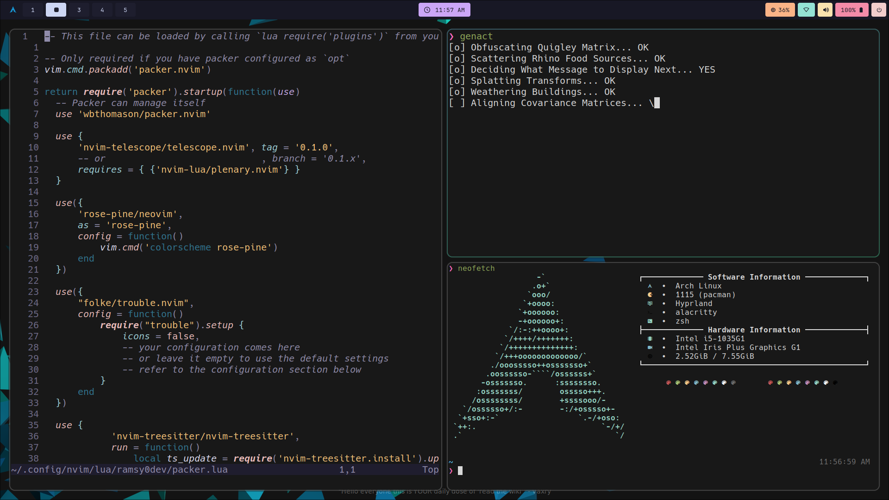

<div align="center">

# ramsy0dev's dotfiles


</div>

---

This is my personal Hyprland dotfiles, i took a couple of ensparations from some dotfiles in **[The Hall of Fame](https://hyprland.org/hall_of_fame/)** and some other random ones i found on github.

# Table of content

* [Dependencies](#dependencies)
* [Installation](#installation)
* [Other screenshots](#other-screenshots)
* [References](#references)

# Dependencies

* [yay](https://github.com/Jguer/yay): A package manager for Arch Linux, similar to pacman but designed to handle AUR packages.
* [hyprland-git](https://aur.archlinux.org/packages/hyprland-git) or [hyprland](https://github.com/hyprwm/Hyprland): A window manager based on Hyprland.
* [nemo](https://github.com/linuxmint/nemo): A file manager for the Cinnamon desktop environment.
* [waybar](https://github.com/Alexays/Waybar): A highly customizable Wayland bar.
* [kitty](https://sw.kovidgoyal.net/#kitty): A modern, hackable, featureful, OpenGL-based terminal emulator.
* [alacritty](https://github.com/alacritty/alacritty): A cross-platform, GPU-accelerated terminal emulator.
* [dunst](https://github.com/dunst-project/dunst): A lightweight replacement for the notification daemons provided by most desktop environments.
* [rofi](https://github.com/davatorium/rofi): A window switcher, Application launcher and dmenu replacement.
* [eza](https://github.com/daniel-j-hermansson/eza): An image viewer for the terminal.
* [grim](https://github.com/emersion/grim): Grab images from a Wayland compositor and write them to a file.
* [slurp](https://github.com/emersion/slurp): Select a region in a Wayland compositor.
* [qt6-wayland](https://www.qt.io/blog/qt-for-the-linux-desktop-part-ii-wayland-and-high-dpi): Qt libraries for Wayland and High DPI displays.
* [neovim](https://github.com/neovim/neovim): Hyperextensible Vim-based text editor.
* [neofetch](https://github.com/dylanaraps/neofetch): A command-line system information tool.
* [curl](https://curl.se/download.html): A tool to transfer data from or to a server, supporting a wide range of protocols.
* [git](https://git-scm.com/downloads): A distributed version control system.

# Installation

There is a install script `install.sh` which will install everything you will be needing for this dotfiles, this includes deps and the Hack Nerd font, after that it will copy the config files from `./configs` to `$HOME/.config`, so you just need to run:

```bash
bash install.sh
```

# Other screenshots



# References

* The hyprland wiki: https://wiki.hyprland.org/
* Dotfiles that are in **the Hall of Fame**: https://hyprland.org/hall_of_fame
* The archlinux wiki: https://wiki.archlinux.org/
